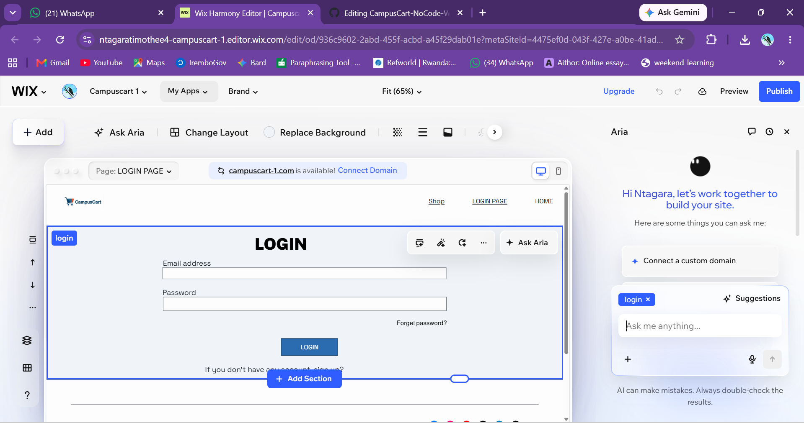
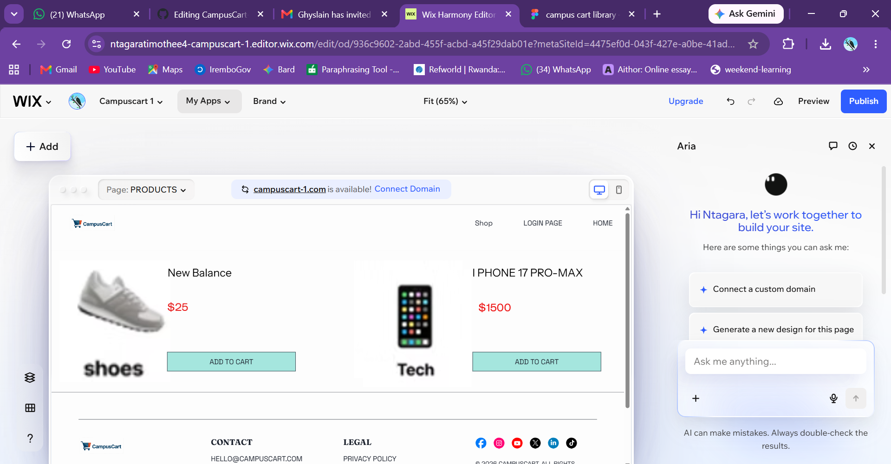
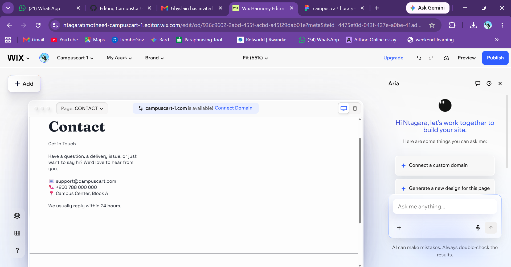
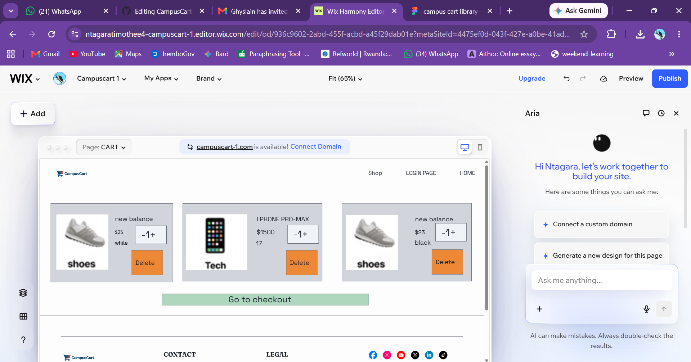

# CampusCart – No-Code E-Commerce Website (Assignment IV-b)

## Student Information
- **Course:** INSY 8313 – Management Information System (MIS)
- **Instructor:** Eric Maniraguha
- **Assessment:** Group Assignment IV-b – No-Code/Low-Code E-Commerce Application Development Project
- **Student Name:** NTAGARA Timothe (29504)
- **Student Name:** ISHIMWE Ghyslain (29601)

---

## Project Title
**CampusCart — The Student's Marketplace**

---

## Platform Used
**Wix**

---

## Project Description
CampusCart is an online store designed for university students to conveniently buy affordable academic supplies, dorm essentials, footwear, and apparel without leaving campus. It solves the problem of students needing quick, budget-friendly access to daily necessities amid tight schedules. This project transforms the UI/UX design created in Figma (Assignment IV-a) into a live, functional no-code e-commerce website.

---

## Project Links
- **Live Website:** [https://ntagaratimothee4.wixsite.com/campuscart-1]
- **Figma Design (Assignment IV-a):** [https://www.figma.com/design/9pTqUbu17suvk7chV4ThHZ/campus-cart-library?node-id=0-1&t=joKwr3U5zTm4DjTK-1]
- **GitHub Repository:** https://github.com/ntagaratimothee4-eng/CampusCart-NoCode-Website

---

## Features Implemented

### 1. Homepage & Navigation
- Store name (**CampusCart**), clear visual branding, hero banner ("The Student's Marketplace"), and mission introduction.
- Consistent navigation menu across all subpages (`HOME`, `Shop`, `LOGIN PAGE`, `CONTACT`, `CART`).

### 2. User Authentication (Login Page)
- Dedicated **Login Page** with input fields for Email Address and Password.
- "Forgot password?" prompt and sign-up redirection link (`If you don't have any account, sign up?`).

### 3. Product Catalog Page
- Product grid displaying 5+ student items complete with high-resolution images, names, prices, and clear product descriptions:
  - **New Balance Shoes** ($25)
  - **iPhone 17 Pro-Max** ($1500)
  - Collapsible Silicone Flask, Glass Sport Infuser, and Double Wall Insulated Bottle.
- Interactive **`ADD TO CART`** buttons on each product card.

### 4. About Us Page
- Dedicated section explaining CampusCart's background, campus community focus, and purpose.

### 5. Contact & Support Center
- Dedicated **Contact Page** providing customer support channels:
  - **Email:** `support@campuscart.com`
  - **Phone:** `+250 788 000 000`
  - **Location:** Campus Center, Block A
  - Interactive **Contact Form** for student inquiries.

### 6. Interactive Shopping Cart & Checkout Flow
- Working **Cart Page** featuring item management:
  - Real-time quantity adjustment (`- 1 +`).
  - Item removal option (`Delete`).
  - Simulated checkout call-to-action button (**`Go to checkout`**).

---

## 📸 Screenshots

### 1. User Authentication (Login Page)


### 2. Product Catalog Page


### 3. Customer Contact Page


### 4. Interactive Shopping Cart


---

## Accessibility Considerations
- Clear, high-contrast headings and body text for optimal readability.
- Consistent navigation structure (`HOME`, `Shop`, `LOGIN PAGE`, `CONTACT`, `CART`) across all pages.
- Logical page hierarchy with descriptive, bold section headings (`LOGIN`, `CONTACT`, `CART`).
- Readable typography sizes and accessible interactive buttons throughout the site.

---

## Challenges Faced
- Google Sites was initially evaluated but lacked the styling flexibility (custom fonts, distinct containers, real input fields) required to faithfully replicate our Figma design, leading us to migrate to Wix.
- Adapting Wix container boxes to lock text, images, and buttons together so product cards remain structured across different screen sizes.

---

## Lessons Learned
- How to effectively translate a Figma UI/UX blueprint into a live no-code website on Wix[cite: 3].
- Hands-on experience implementing e-commerce components (product catalogs, custom inputs, interactive carts)[cite: 3].
- Evaluating software design platforms and selecting the best tool based on technical requirements[cite: 3].

---

## Repository Structure
```text
CampusCart-NoCode-Website/
│
├── README.md
│
└── images/
    ├── login-page.png
    ├── products-page.png
    ├── contact-page.png
    └── cart-page.png
